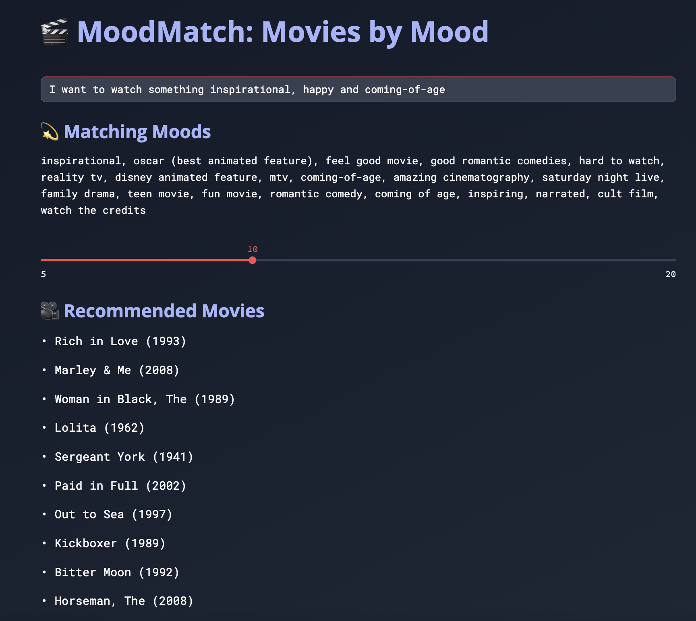

# 🎬 MoodMatch: Movie Recommender by Mood

This is a Streamlit-based web app that recommends movies based on the mood or feeling you describe in plain English. Using semantic embeddings of movie genome tags and user input, it generates a personalized list of film suggestions.



---

## 📁 Project Structure

```MovieRec/
├── data/
│ ├── movies.csv
│ ├── genome-tags.csv
│ ├── genome-scores.csv
│ └── movie_tag_matrix.csv
├── embeddings.py
├── utils.py
├── recommendersite.py
├── requirements.txt
└── README.md
```

## 💡 Features

- **Natural language input** for describing your mood (e.g., "tragic but beautiful", "funny and romantic").
- Uses **Sentence Transformers (MiniLM)** to match your mood with relevant movie tags.
- Recommends top **matching movies** from the MovieLens dataset.
- Beautiful dark-themed UI with custom fonts and layout.
- Tag clusters and semantic outliers for better tag organization (optional).

---

## 🧠 How it works

1. Each movie tag is embedded using `all-MiniLM-L6-v2` from the Sentence Transformers library.
2. User input is embedded the same way and matched against tag embeddings via cosine similarity.
3. The most similar tags are used to score and rank movies based on genome relevance.
4. Results are shown in a clean UI via Streamlit.

---

## 📁 Data
The MovieLens dataset has been used, which can be downloaded from https://grouplens.org/datasets/movielens/latest/
Download the required files and place them in the data/ folder:

movies.csv

genome-tags.csv

genome-scores.csv


---

## 🛠️ Setup Instructions


```bash
git clone https://github.com/s4r1n4/MovieRec.git
cd MovieRec
```
```
pip install -r requirements.txt
```
```
streamlit run streamlit_app.py
```

